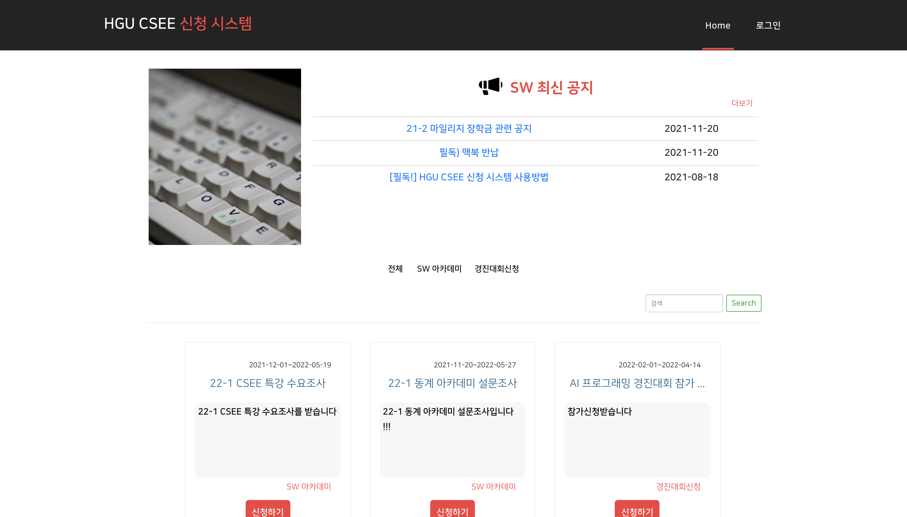

# OAS

## 💡 Goal
* 학부 공지에서 진행중인 프로그램 파악 어려움 해소 
* 실시간으로 프로그램 신청 신청 현황 확인 
* 개별적으로 학생들에게 연락하여 신청결과를 안내하는 과정 단순화 

## 📱 Functions
* 설문지 작성 및 배포
* 설문지 응답
* 설문지 상태 관리
* 회원 관리 (Excel로 export 가능)

## 🛠 Stacks
- Spring, MariaDB
- JSP, CSS, Javascript

## 🎥 Demo
[https://youtu.be/kl65UwHsPqk](https://youtu.be/kl65UwHsPqk)  

